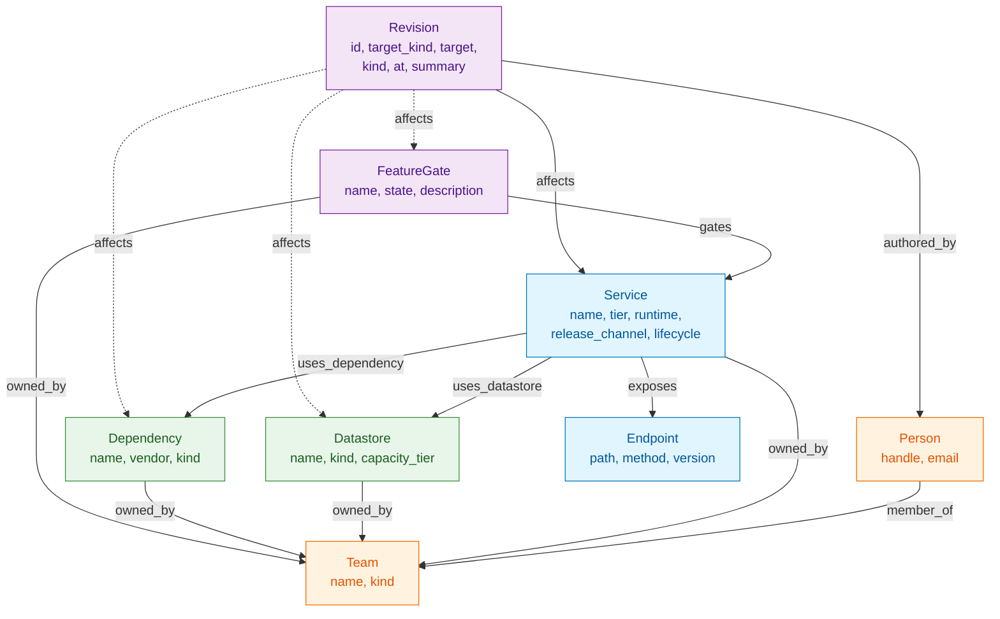
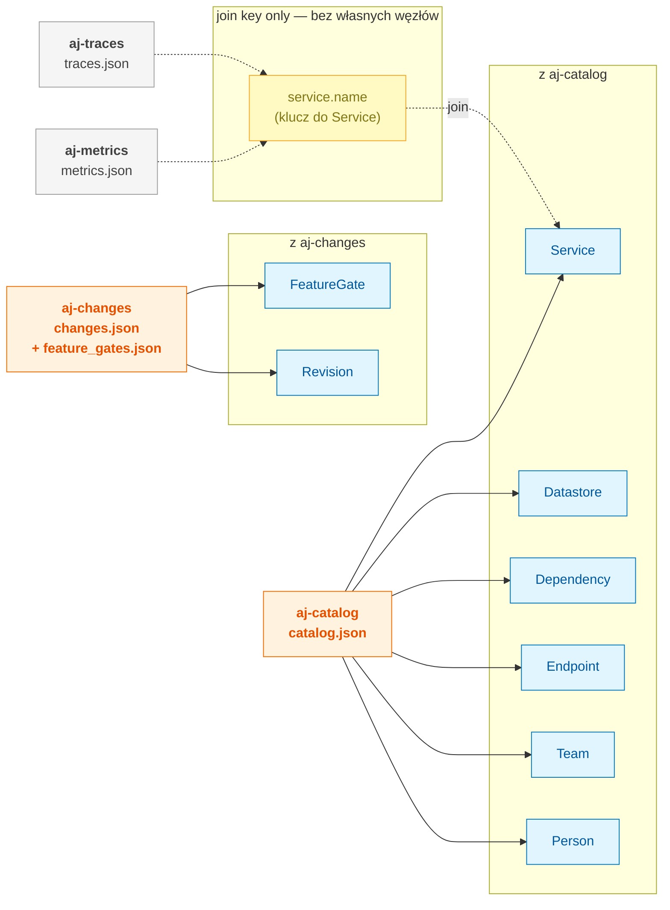
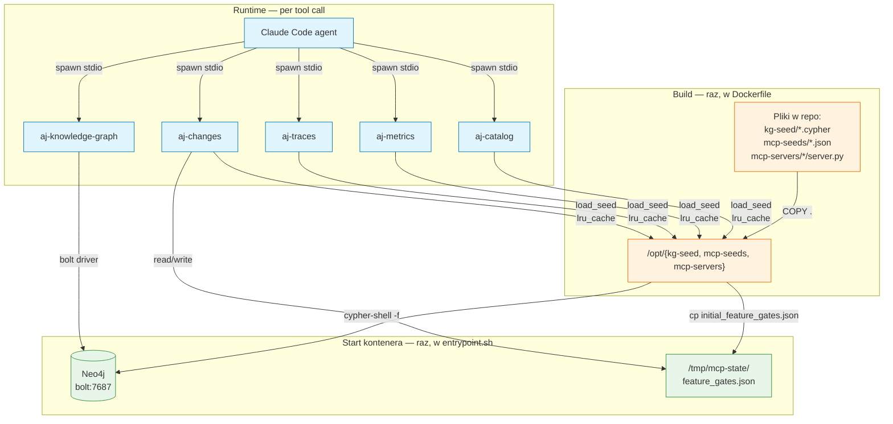
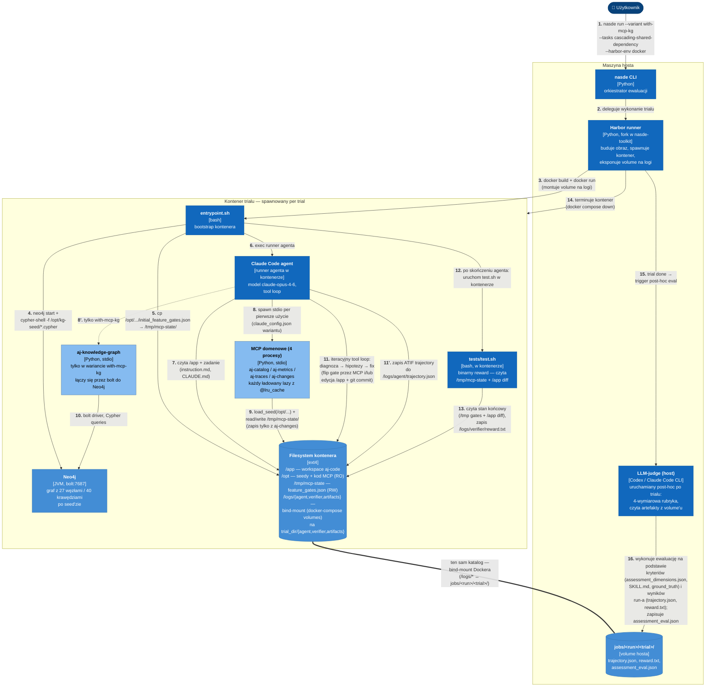

# Benchmark `kg-incidents` — projekt ewaluacji

Ten dokument opisuje, jak zaprojektowany jest benchmark oceniający, czy **knowledge graph** daje mierzalną przewagę modelom językowym podczas diagnozy incydentów produkcyjnych. Jest pomyślany jako wprowadzenie dla osób, które zobaczą benchmark po raz pierwszy — tłumaczy *dlaczego* jest zbudowany właśnie tak, oraz *jakie konkretne decyzje projektowe* za tym stoją.

---

## 1. Co mierzy benchmark

W realnym incident response inżynier dyżurny (którego symuluje agent) nie ma jednego "magicznego narzędzia". Ma:

- katalog serwisów (kto co posiada, kto czego używa),
- metryki (wykresy latency, throughput, error rate),
- logi i distributed traces (co się działo w konkretnym requeście),
- historię zmian (kto co zdeployował i kiedy).

Wszystkie te źródła odpowiadają na różne pytania i są trzymane w **osobnych systemach**. Sklejanie informacji z nich w jedną hipotezę to duża część pracy dyżurnego.

**Knowledge graph** łączy te informacje w **jeden trawersowalny model**: serwisy jako węzły, zależności jako krawędzie, zmiany jako dołączone do węzłów zdarzenia. Pytanie "kto jeszcze używa tej bazy?" staje się jednym zapytaniem zamiast iteracji przez katalog.

Benchmark odpowiada na trzy konkretne pytania o rolę grafu w diagnozie:

- czy model typu Claude Opus **sam** potrafi skleić te informacje "w głowie" z rozproszonych źródeł, bez grafu?
- a jeśli potrafi — czy graf robi to **taniej** (mniej tokenów, szybciej)?
- a może graf daje **nową zdolność**, której model bez niego nie ma w ogóle?

Odpowiadają im trzy hipotezy (zdolność / efektywność / brak efektu):

- **H1 (graf umożliwia zdolność)** — bez grafu model nie jest w stanie dotrzeć do root cause
- **H2 (graf jako multiplikator efektywności)** — model dociera do root cause w obu przypadkach, ale z grafem szybciej i taniej
- **H0 (brak efektu)** — graf nic nie zmienia, bo model i tak radzi sobie dobrze

Benchmark rozstrzyga **empirycznie**, która z nich odpowiada rzeczywistości.

---

## 2. Scenariusz — incydent, który agent dostaje do rozwiązania

Scenariusz `cascading-shared-dependency` spełnia cztery wymagania:

- **jest rozwiązywalny** — to nie zagadka na zasadzie "nigdy nie zgadniesz",
- **root cause jest naprawdę ukryty** — alert nie wskazuje palcem na przyczynę,
- **istnieje wiele rozsądnych hipotez** do rozważenia (inaczej test niczego nie ocenia),
- **root cause wymaga łączenia informacji z różnych źródeł** — inaczej graf nie pomaga.

### Alert, który widzi agent

Zadanie jest sformułowane jak wiadomość od systemu monitoringu:

```
[ALERT] ai_description_latency_p99_degradation
component:   ai-description
metric:      p99 latency
value:       4200ms (baseline: 1300ms)
duration:    ongoing 2h 15min
severity:    high
```

Tyle. Usługa `ai-description` zwalnia w niezrozumiały sposób.

### Co naprawdę się stało (root cause)

Cztery godziny temu zespół produktowy **włączył feature gate** `warehouse-full-inventory-sync`. Aktywowało to w innym serwisie (`warehouse`) pętlę synchronizacji: raz na minutę serwis odpytuje API o każdy SKU w magazynie, generując ~2000 zapytań/minutę. Każde zapytanie trafia przez `host-app` do bazy `postgresql-primary`.

Tu zaczyna się problem: **`ai-description` używa tej samej bazy** `postgresql-primary`. Connection pool HikariCP w host-app (20 connections) zostaje nasycony przez warehouse. Kiedy `ai-description` próbuje pobrać metadane produktu (żeby potem wywołać LLM z odpowiednim kontekstem), czeka średnio 2500ms na wolne connection. Dopiero potem robi call do LLM. Całkowite p99 `ai-description` skacze z 1300ms do 4200ms.

**Kluczowa obserwacja:** przyczyna jest w zupełnie innym serwisie (`warehouse`, funkcjonalnie niepowiązany z `ai-description`). Bez mapy "kto używa której bazy" agent ma problem zorientować się, gdzie szukać winowajcy.

### Dwa fałszywe tropy

Scenariusz zawiera dwa ślepe zaułki, które odciągają uwagę od prawdziwego root cause:

1. **Niedawny deploy `ai-description`**: 18h temu ten serwis dostał patch ("refactor cache to LazyLoader"). To naturalny pierwszy podejrzany — "co się ostatnio zmieniło na tym, co zwalnia?". Ale 18h to zbyt daleko: incydent zaczął się 2h 15min temu. Timing nie pasuje i agent musi to rozumowo odrzucić.

2. **Spike latency na `litellm-proxy`**: w tym samym oknie czasowym LiteLLM (proxy do modeli LLM) też pokazuje podwyższoną latency. Wygląda, jakby to "LLM był wolny" — w końcu to LLM jest na ścieżce `ai-description`. W rzeczywistości to **skutek**, nie przyczyna: LLM calls czekają na tym samym pool'u DB connections, co wszystko inne. Powierzchniowo wygląda na winowajcę.

Te tropy są integralną częścią benchmarku: mierzą, jak **efektywnie** agent je odrzuca — to dokładnie kompetencja, którą chcemy obserwować.

---

## 3. Dwa warianty — eksperyment kontrolowany

Benchmark porównuje dwie wersje tego samego zadania, które różnią się **tylko jedną rzeczą**: dostępem do knowledge graphu.

| wariant | zarejestrowane serwery MCP | rola |
|---|---|---|
| `with-mcp` | `aj-catalog`, `aj-metrics`, `aj-traces`, `aj-changes` | Baseline — pełna diagnostyka domenowa, bez grafu |
| `with-mcp-kg` | powyższe + `aj-knowledge-graph` | Eksperymentalny — dodaje traversal po topologii |

Wszystko inne jest identyczne: seedy, zadanie, test weryfikujący, model (Claude Opus 4.6). Różnica jest czysto w **dostępie do narzędzia**.

> **Co to jest MCP?** Model Context Protocol. W uproszczeniu — sposób, w jaki agent (Claude Code) wywołuje zewnętrzne narzędzia. Każdy serwer MCP eksponuje zestaw funkcji (np. `list_services()`, `query_metric(...)`), które agent widzi jako dostępne tools. Claude Code wywołuje je tak samo naturalnie jak `Read` czy `Bash`. W benchmarku MCP serwery to krótkie programy Pythonowe zwracające wyniki z zaseedowanych danych mock.

### Dlaczego `CLAUDE.md` jest różny dla obu wariantów

W `with-mcp-kg` agent dostaje w `CLAUDE.md` krótki opis grafu — jakie są labele, jakie krawędzie, kiedy warto użyć grafu zamiast MCP domenowych. Brak konkretnych recept ("najpierw sprawdź shared datastore przez `get_neighbors(...)`" — byłby to leakage).

**To legalne ułatwienie.** W realnym świecie, gdy firma wdraża nowe narzędzie, dostarcza z nim też dokumentację. Benchmark nie testuje, czy agent sam odkryje, co to jest knowledge graph. Testuje, czy agent — wiedząc, że graf istnieje — potrafi go wykorzystać efektywniej niż działać bez niego.

W `with-mcp` natomiast `CLAUDE.md` wymienia tylko 4 dostępne MCP (bez grafu). Minimalnie i symetrycznie.

---

## 4. Pięć serwerów MCP — gdzie leżą dane

Każdy serwer MCP odpowiada za **jeden typ informacji**. Razem dają obraz platformy, którą agent diagnozuje.

Z 23 narzędzi łącznie, **22 to odczyt**, **1 to zapis** (`aj-changes.set_feature_gate_state`). To świadomy design — agent ma pełną swobodę obserwacji, ale tylko jedno "pokrętło" do kręcenia produkcją.

### `aj-catalog` — "Gdzie co leży, kto to posiada?"

Płaskie wyszukiwania po encjach. Analog produkcyjnego narzędzia w stylu Backstage czy Cortex.

| narzędzie | typ | opis |
|---|---|---|
| `list_services(tier?)` | odczyt | Lista serwisów, opcjonalny filtr po tier (`core`/`extension`/`integration`) |
| `find_service(name)` | odczyt | Pełne szczegóły serwisu: owner team, używane datastores/dependencies, wystawiane endpointy |
| `list_datastores(kind?)` | odczyt | Lista baz danych, filtr po kind (`relational`/`keyvalue`/`object`) |
| `find_datastore(name)` | odczyt | Szczegóły bazy: kind, capacity_tier, owner team |
| `list_endpoints(exposed_by_service?)` | odczyt | Wystawiane endpointy HTTP |
| `list_dependencies()` | odczyt | Zewnętrzne zależności (LLM proxy, tracing, PII) |
| `find_dependency(name)` | odczyt | Szczegóły zależności: vendor, kind, owner |
| `list_teams(kind?)` | odczyt | Zespoły, filtr po kind (`product`/`platform`/`partner`) |
| `find_team(name)` | odczyt | Szczegóły zespołu + członkowie |
| `find_person(handle)` | odczyt | Osoba po handle (email) |

Świadomie **brak** `list_services_using_datastore(name)` — patrz asymetria poniżej.

### `aj-metrics` — "Jak coś działa?"

24 godziny danych w 5-minutowych kubełkach (p50/p99/avg/count). Seed zawiera cztery zaplantowane spike'i (warehouse zalewa DB, pool connections się nasyca, ai-description zwalnia, litellm opóźnia się jako skutek) plus stabilne baselines dla innych serii.

| narzędzie | typ | opis |
|---|---|---|
| `list_metrics(service?)` | odczyt | Dostępne metryki (nazwa, jednostka), opcjonalny filtr po serwisie |
| `query_metric(service, metric, window_start, window_end)` | odczyt | Kubełki czasowe w oknie ISO 8601 |
| `list_services_with_metrics()` | odczyt | Zdeduplikowana lista serwisów, dla których są jakiekolwiek metryki |

### `aj-traces` — "Co się działo w konkretnym requeście?"

Przykładowe distributed traces. Kluczowe: zaplantowany trace z incydentu pokazuje spany z `db_wait_ms: 2500` (agent widzi, że opóźnienie jest w czekaniu na DB connection). Plus trace sprzed incydentu z `db_wait_ms: 5` — dla porównania baseline z aktualnym stanem.

| narzędzie | typ | opis |
|---|---|---|
| `search_traces(service?, endpoint?, window_start?, window_end?, min_duration_ms?, limit?)` | odczyt | Wyszukiwanie traces po filtrach, zwraca summary |
| `get_trace(trace_id)` | odczyt | Pełne drzewo spanów dla konkretnego trace'a |

### `aj-changes` — "Co się zmieniło?"

Historia revision'ów (deploye, zmiany konfiguracji, flip'y feature gates) + zarządzanie feature gates. Zawiera **jedyną w całym benchmarku operację modyfikującą stan**.

| narzędzie | typ | opis |
|---|---|---|
| `list_revisions(target?, window_start?, window_end?, kind?)` | odczyt | Lista zmian po filtrach (substring target, typ zmiany, okno czasowe) |
| `get_revision(id)` | odczyt | Pełne szczegóły revision + `long_description` |
| `list_feature_gates(service?)` | odczyt | Lista feature gates z bieżącym stanem |
| `get_feature_gate(name)` | odczyt | Szczegóły gate: description, gated_services, owner_team, latest_revision_id, state |
| **`set_feature_gate_state(name, state)`** | **zapis** | **Mutacja stanu**: zmienia gate na `on`/`off`/`rollout`, zapisuje `/tmp/mcp-state/feature_gates.json`, loguje syntetyczny revision |

### `aj-knowledge-graph` — traversal topologii (tylko `with-mcp-kg`)

Neo4j-backed knowledge graph. Brak `run_cypher()` — byłoby zbyt potężne, agent mógłby w jednym zapytaniu zrobić cały traversal, co rozmyłoby eksperyment.

| narzędzie | typ | opis |
|---|---|---|
| `get_graph_schema()` | odczyt | Opis ontologii: labele z atrybutami + typy krawędzi z mapowaniem źródło/cel (plain text) |
| `find_nodes(label, filters?)` | odczyt | Wyszukiwanie węzłów po labelu i atrybutach. Bez filtrów → summary (id/label/name), z filtrami → pełne atrybuty |
| `get_neighbors(node_id, edge?, direction?)` | odczyt | Trawersal krawędzi od węzła. Kierunek `out`/`in`/`both`, opcjonalny filtr po typie krawędzi |

### Asymetria: catalog nie ma "kto używa tej bazy"

To jest jedna z najważniejszych decyzji projektowych benchmarku. `aj-catalog` zwraca dla `find_service("ai-description")` płaską listę: `uses_datastore_names: ["postgresql-primary"]`. Jeśli agent chce wiedzieć, kto **jeszcze** używa tej bazy, musi:

1. wywołać `list_services()`,
2. iterować po wszystkich serwisach,
3. dla każdego wywołać `find_service(name)`,
4. sprawdzić, czy jego lista `uses_datastore_names` zawiera interesującą bazę.

W grafie to samo jest jednym zapytaniem: `get_neighbors("Datastore:postgresql-primary", "uses_datastore", "in")` — zwraca od razu listę serwisów.

Ta **asymetria** jest sednem eksperymentu. Benchmark mierzy, jak bardzo różnica w dostępie wpływa na czas, koszt tokenów i liczbę wywołań narzędzi. Gdyby catalog miał `list_services_using_datastore(name)`, warianty byłyby zrównane i nic by się nie różniło.

---

## 5. Ontologia grafu — OTG (Operational Topology Graph)

Graf ma własny model danych zaprojektowany pod ten scenariusz. 

### Schemat ontologii



**Osiem labeli węzłów** (pogrupowanych wg roli):

*Encje core* (niebieskie):
- `Service` (host-app, ai-description, warehouse, box-size) — serwisy
- `Endpoint` — API endpointy wystawiane przez serwisy

*Infrastruktura* (zielone):
- `Datastore` (postgresql-primary, redis-cache, minio-assets) — bazy danych, cache, object storage
- `Dependency` (litellm-proxy, langfuse-tracing, presidio-pii) — zewnętrzne zależności

*Ludzie i zespoły* (pomarańczowe):
- `Team` (platform-core, ai-team, warehouse-product) — zespoły
- `Person` — osoby

*Zdarzenia i konfiguracja* (fioletowe):
- `FeatureGate` — flagi feature'ów
- `Revision` — zdarzenie zmiany (deploy, config change, gate flip)

**Osiem typów krawędzi:** `owned_by`, `member_of`, `exposes`, `uses_datastore`, `uses_dependency`, `affects`, `authored_by`, `gates`.

Krawędź `affects` jest wielocelowa — Revision może zmieniać Service, Datastore, Dependency lub FeatureGate (na schemacie ciągła dla głównego przypadku, przerywane dla pozostałych). Pozostałe krawędzie mają jednoznaczne source/target.

---

## 6. Mapowanie ontologii na źródła MCP

Graf w `aj-knowledge-graph` to nie nowe dane — to **ten sam materiał, który leży w 4 domenowych MCP**, tylko poskładany w trawersowalny model. Każdy label OTG i każda krawędź ma swoje pierwotne źródło w jednym (lub kilku) seedach domenowych. Ta sekcja to zwięzła mapa: skąd graf bierze poszczególne elementy ontologii.

### Diagram: który MCP dostarcza który label OTG

Po lewej — serwery MCP. Po prawej — labele OTG, pogrupowane wg dostarczającego źródła. Krawędzie ontologii (`owned_by`, `exposes`, `uses_datastore`, …) są pominięte celowo — są w schemacie ontologii w sekcji 5 i w tabeli krawędzi poniżej. Tutaj liczy się tylko jedno: **skąd graf bierze każdy węzeł**.



Pomarańczowe = serwery wnoszące węzły do grafu. Szare = serwery, które **nie wnoszą żadnych encji** — używają tylko `service.name` jako klucza spinającego dane szeregów czasowych z węzłami `Service` z `aj-catalog` (analogicznie do OTel `service.name`).

### Tabela: label → źródło → tool, którym agent dotyka tych samych danych przez MCP

| Label OTG | Źródło danych | Sekcja w seedzie | Atrybuty (skąd) | Tool MCP, który zwraca to samo |
|---|---|---|---|---|
| `Service` | `aj-catalog` | `catalog.json:services[]` | name, tier, runtime, release_channel, lifecycle | `list_services()`, `find_service(name)` |
| `Datastore` | `aj-catalog` | `catalog.json:datastores[]` | name, kind, capacity_tier | `list_datastores()`, `find_datastore(name)` |
| `Dependency` | `aj-catalog` | `catalog.json:dependencies[]` | name, vendor, kind | `list_dependencies()`, `find_dependency(name)` |
| `Endpoint` | `aj-catalog` | `catalog.json:services[].exposed_endpoints[]` | path, method, version | `list_endpoints(exposed_by_service?)` |
| `Team` | `aj-catalog` | `catalog.json:teams[]` | name, kind | `list_teams()`, `find_team(name)` |
| `Person` | `aj-catalog` | `catalog.json:persons[]` (handle = email) | handle, email | `find_person(handle)` |
| `FeatureGate` | `aj-changes` | `changes.json:feature_gates[]` + `/tmp/mcp-state/feature_gates.json` (state) | name, description, owner_team, **state** (mutowalny) | `list_feature_gates()`, `get_feature_gate(name)` |
| `Revision` | `aj-changes` | `changes.json:revisions[]` | id, target_kind, target, kind, at, summary | `list_revisions()`, `get_revision(id)` |

### Tabela: krawędź → skąd graf ją derywuje

| Krawędź OTG | Z którego pola seeda jest budowana | MCP source |
|---|---|---|
| `Service -[owned_by]-> Team` | `services[].owner_team` | `aj-catalog` |
| `Datastore -[owned_by]-> Team` | `datastores[].owner_team` | `aj-catalog` |
| `Dependency -[owned_by]-> Team` | `dependencies[].owner_team` | `aj-catalog` |
| `FeatureGate -[owned_by]-> Team` | `feature_gates[].owner_team` | `aj-changes` |
| `Person -[member_of]-> Team` | `teams[].members_handles[]` (lista handle'i osób) | `aj-catalog` |
| `Service -[exposes]-> Endpoint` | `services[].exposed_endpoints[]` (zagnieżdżona lista w serwisie) | `aj-catalog` |
| `Service -[uses_datastore]-> Datastore` | `services[].uses_datastore_names[]` | `aj-catalog` |
| `Service -[uses_dependency]-> Dependency` | `services[].uses_dependency_names[]` | `aj-catalog` |
| `FeatureGate -[gates]-> Service` | `feature_gates[].gated_services[]` | `aj-changes` |
| `Revision -[affects]-> Service\|Datastore\|Dependency\|FeatureGate` | `revisions[].target` + `revisions[].target_kind` (`service`/`datastore`/`dependency`/`gate`) | `aj-changes` |
| `Revision -[authored_by]-> Person` | `revisions[].authored_by_handle` | `aj-changes` (`handle` rozwiązywany przeciw `aj-catalog.persons`) |

### Gdzie graf nie wnosi nic ponad MCP

`aj-metrics` i `aj-traces` celowo **nie są** w grafie — są to **dane szeregów czasowych** (kubełki metryk, drzewa spanów), nie struktura topologii. Graf używa tylko ich klucza join'u: pole `service` w `query_metric(service, metric, …)` i `service` w `search_traces(service, …)` to ta sama wartość, co `Service.name` w grafie. Spinanie ich z grafem odbywa się **na poziomie agenta**: graf odpowiada na pytanie "jakie serwisy używają tej bazy?", a `aj-metrics` / `aj-traces` na pytanie "co się działo z serwisem X w oknie czasowym Y?". Każde z osobna jest płytkie; razem dają diagnozę.

### Asymetria, którą tłumaczy mapowanie

Sekcja 4 wspomina, że `aj-catalog` świadomie nie ma `list_services_using_datastore(name)`. Mapa źródeł pokazuje dlaczego ta asymetria istnieje **mimo że dane są te same**: w seedzie `catalog.json` relacja "service → datastore" jest zapisana tylko po jednej stronie (jako lista nazw na serwisie). Aby odwrócić ten kierunek, `aj-catalog` musiałby zaiterować po wszystkich serwisach. Graf w `aj-knowledge-graph` materializuje tę krawędź w obu kierunkach (`uses_datastore` w Neo4j to relacja, którą można trawersować `out` lub `in`) — i to jest dokładnie to, co czyni go tańszym niż MCP domenowe dla pytań "kto jeszcze używa X".

**Wniosek dla benchmarku:** graf nie dodaje **wiedzy** ponad MCP domenowe. Dodaje **dwukierunkowość** istniejących relacji i **lokalność** trawersalu (sąsiad sąsiada w jednym tool callu). To jest mierzona różnica.

---

## 7. Jak działa ładowanie danych

Seedy są ładowane w **dwóch momentach** i w **dwóch różnych warstwach pamięci**.

### Moment 1: Start kontenera (raz per trial, w `entrypoint.sh`)

Gdy Harbor startuje kontener zadania, `entrypoint.sh` wykonuje sekwencję **przed** uruchomieniem agenta:

```bash
# 1. Start Neo4j w tle
/opt/neo4j/bin/neo4j start

# 2. Czekaj aż Neo4j odpowie na bolt://127.0.0.1:7687
until cypher-shell "RETURN 1"; do sleep 1; done

# 3. Wczytaj seed grafu
cypher-shell -f /opt/kg-seed/schema.cypher        # constraints + indexes
cypher-shell -f /opt/kg-seed/static-nodes.cypher  # 27 węzłów, 40 krawędzi

# 4. Skopiuj stan startowy feature gates
mkdir -p /tmp/mcp-state
cp /opt/mcp-seeds/initial_feature_gates.json /tmp/mcp-state/feature_gates.json

# 5. Przekaż sterowanie runnerowi agenta
exec "$@"
```

Po tym kroku:
- Neo4j ma komplet danych w pamięci (te pozostaną do końca trialu)
- `/tmp/mcp-state/feature_gates.json` zawiera wartości startowe stanu, który może być modyfikowany przez `set_feature_gate_state`

`entrypoint.sh` **nie startuje** żadnego z 5 serwerów MCP. Są uruchamiane dopiero później, na żądanie.

### Moment 2: Każde wywołanie narzędzia (lazy, w procesach MCP)

Gdy agent wywołuje narzędzie MCP, dzieje się kaskada:

**A. Claude Code spawnuje proces serwera** (stdio transport). Na podstawie `claude_config.json` wariantu — np. dla `aj-catalog`:

```json
{
  "type": "stdio",
  "command": "python3",
  "args": ["/opt/mcp-servers/aj-catalog/server.py"]
}
```

Proces żyje przez czas komunikacji JSON-RPC po stdio.

**B. Serwer w Pythonie ładuje seed leniwie — z `@lru_cache`.**

Wszystkie serwery domenowe używają wspólnego `shared/seed_loader.py`:

```python
@lru_cache(maxsize=None)
def load_seed(filename: str) -> Any:
    path = _task_root() / "mcp-seeds" / filename
    with path.open(encoding="utf-8") as f:
        return json.load(f)
```

Plik JSON jest czytany **raz** per proces serwera, przy pierwszym wywołaniu. Każde kolejne wywołanie tego samego narzędzia dostaje cached obiekt Python — brak kosztu re-parsingu.

**C. `aj-knowledge-graph` idzie inną ścieżką.** Nie czyta JSON — łączy się z Neo4j przez bolt:

```python
_BOLT_URI = "bolt://127.0.0.1:7687"

def _get_driver():
    global _driver
    if _driver is None:
        _driver = GraphDatabase.driver(_BOLT_URI)
    return _driver
```

Dane są już w Neo4j od momentu startu kontenera (krok 3 w entrypoint.sh). Serwer KG wykonuje Cypher queries przeciw temu driverowi.

**D. `aj-changes` jest hybrydą.** Czyta historię zmian z `mcp-seeds/changes.json` (jak pozostałe domenowe MCP), ale stan feature gates z `/tmp/mcp-state/feature_gates.json`:

```python
def _gate_state() -> dict:
    with _STATE_FILE.open() as f:
        return json.load(f)
```

Przy każdym wywołaniu `list_feature_gates` / `get_feature_gate` serwer czyta aktualny stan. Gdy agent wywoła `set_feature_gate_state`, plik zostaje zaktualizowany — kolejne wywołania widzą nową wartość.

### Schemat całości



### Stan vs seed — zamienność

- **Seedy** (`mcp-seeds/*.json`, `kg-seed/*.cypher`) — **read-only** w trakcie trialu. Nigdy się nie zmieniają.
- **Stan** (`/tmp/mcp-state/feature_gates.json`) — **mutowalny** przez agenta. Startuje z kopii seedu, żyje przez jeden trial.
- **Pamięć Neo4j** — po starcie kontenera również read-only. Mimo że MERGE jest w Cypherze, serwer KG nie zawiera operacji zapisujących do grafu.

Między trialami wszystko jest resetowane — kontener to kontener, nowy trial = nowy start `entrypoint.sh` = świeża kopia stanu.

### Dlaczego taki podział

- **Neo4j dla grafu** — realistyczna platforma (catalog w grafowej bazie). Seed ładujemy raz, bo wczytanie 27 węzłów i 40 krawędzi przy każdym tool call byłoby marnotrawstwem.
- **Pliki JSON dla MCP domenowych** — proste, statyczne, `@lru_cache` daje zero-cost re-read. Brak potrzeby osobnej bazy.
- **`/tmp/mcp-state/` dla mutowalnego stanu** — jedyny stan, który zmienia się w trakcie trialu (feature gates). Trzymanie go poza seedami pozwala testowi weryfikującemu (`test.sh`) czytać go bezpośrednio.

---

## 8. Typowe uruchomienie ewaluacji — dynamic view

Sekcja pokazuje, jak **chronologicznie** odbywa się pojedynczy trial: od momentu, w którym użytkownik wpisuje komendę `nasde run`, do zapisania `reward` i artefaktów oceny. Nazewnictwo i poziom abstrakcji odpowiadają **dynamic diagram** w notacji C4 (kontenery i komponenty z ponumerowanymi strzałkami w kolejności wykonania).

### Kontekst: gdzie co działa

Diagram pokazuje trzy strefy wykonania, między którymi przebiega trial:

- **Maszyna hosta** — `nasde CLI` (orkiestracja), `Harbor runner` (spawnuje kontener), oraz **LLM-judge** uruchamiany jako post-hoc proces po trialu (Codex CLI lub Claude Code CLI). Judge nigdy nie wchodzi do kontenera — czyta tylko artefakty wystawione na zamontowanym volume'ie.
- **Kontener trialu spawniony przez Harbor** — w jednym obrazie żyje `entrypoint.sh`, Neo4j, snapshot repo aj-code w `/app`, seedy MCP, runner agenta, procesy MCP oraz `tests/test.sh` (binarny reward). To jest "produkcyjne środowisko ewaluacji".
- **Volume `jobs/<run>/<trial>/`** — kanał komunikacji między tymi dwoma strefami: kontener pisze do niego `trajectory.json` i `reward.txt`, judge na hoście dopisuje `assessment_eval.json`.

Backend dev z `compose.yml` w korzeniu repo (postgres, litellm, langfuse, …) jest **niezwiązany** z ewaluacją — to środowisko deweloperskie towarzyszące kodowi aj-code, nie jest uruchamiany przez Harbor i nie jest częścią pętli trialu, więc został z diagramu pominięty.

### Dynamic diagram



### Komentarz krok po kroku

- **1–3 (start ewaluacji):** użytkownik woła `nasde run` z parametrami wariantu i tasku, Harbor buduje obraz (jeśli nie jest cached) i spawnuje kontener.
- **4–6 (bootstrap kontenera):** `entrypoint.sh` startuje Neo4j, ładuje seed grafu (`schema.cypher` + `static-nodes.cypher`), kopiuje początkowy stan feature gates do `/tmp/mcp-state/`, wreszcie `exec`-uje runner agenta. **MCP serwery jeszcze nie istnieją** jako procesy.
- **7–10 (główna pętla agenta):** agent czyta zadanie, na pierwsze użycie każdego MCP Claude Code spawnuje proces przez stdio. Procesy MCP domenowe ładują swoje seedy lazy (`@lru_cache`) z `/opt` i czytają/piszą `/tmp/mcp-state/feature_gates.json` (zapis tylko z `aj-changes`); `aj-knowledge-graph` zamiast filesystemu otwiera `bolt://127.0.0.1:7687` do Neo4j.
- **11–11' (diagnoza, fix, trajectory):** iteracyjny tool loop aż do hipotezy. Fix może iść trzema ścieżkami: flip gate przez MCP (`set_feature_gate_state('off')`), edycja kodu w `/app` + git commit, lub kombinacja — wszystkie zamykają się w tej samej pętli tool callów (sekcja 10 pokazuje akceptowane ścieżki). Runner agenta równolegle zapisuje **ATIF trajectory** do `/logs/agent/trajectory.json` — to ścieżka **bind-mountowana** na host volume, więc plik fizycznie ląduje w `jobs/<run>/<trial>/agent/` od razu, bez osobnego kroku kopiowania.
- **12–13 (weryfikacja w kontenerze — binarny reward):** po zakończeniu pracy agenta `entrypoint.sh` uruchamia w **tym samym kontenerze** `tests/test.sh`. Skrypt sprawdza stan końcowy (`/tmp/mcp-state/feature_gates.json` i diff w `/app`) i zapisuje `0` lub `1` do `/logs/verifier/reward.txt` — także bind-mount, więc reward również przechodzi na host bez kopiowania.
- **14 (cleanup kontenera):** Harbor terminuje kontener. Trajectory i reward już są na hoście dzięki bind-mountom; Harbor nie musi nic kopiować, tylko zamyka proces. Każdy kolejny trial = nowy kontener = świeży `entrypoint.sh` = świeży Neo4j i świeży `feature_gates.json`. Brak współdzielonego stanu między trialami.
- **15–16 (LLM-judge na hoście — post-hoc):** po terminacji kontenera `nasde` / Harbor wywołuje **LLM-judge na maszynie hosta** — to oddzielny proces uruchamiany przez Codex CLI lub Claude Code CLI (`claude`/`codex` jako binarka), zaprzęgnięty przez `evaluator_skills/incident-diagnosis-review/SKILL.md` i zakotwiczony przez `ground_truth_decisions.json`. Judge **wykonuje ewaluację na podstawie kryteriów** (`assessment_dimensions.json` — definicje 4 wymiarów po 25 pkt — oraz `SKILL.md` i ground truth) **i wyników run-a** (`trajectory.json`, `reward.txt`, `instruction.md`), które sam czyta z podmontowanego katalogu `jobs/<run>/<trial>/` — nikt mu ich nie podaje przez stdin. Wynik (`assessment_eval.json`) zapisuje obok pozostałych artefaktów. **Judge nigdy nie wchodzi do kontenera — kontener już nie istnieje.**

---

## 9. Workspace — repo `aj-code` w `/app`

Zadanie działa w kontenerze Docker. Na starcie `/app` zawiera pełny snapshot repozytorium `aj-code` (Spring Boot host-app + pluginy `warehouse`, `ai-description`, `box-size`). Neo4j uruchomiony jako sidecar, seed wczytany, MCP servery gotowe.

### Po co w benchmarku jest prawdziwy kod

Diagnoza odbywa się przez MCP — we wszystkich pomiarach żaden agent nie przeczytał pliku Javy, wszyscy wybrali flip feature gate przez MCP bez tykania kodu. Mimo to, kod jest istotną częścią scenariusza. Z trzech powodów.

**Po pierwsze — obecność kodu zmusza agenta do wykluczenia hipotezy.** Realistyczny incydent zawsze zawiera pytanie "a może to bug w kodzie?". Agent widząc Spring Boot project w `/app` musi **aktywnie zdecydować**, że kod nie jest winowajcą (na podstawie timingu, ownership, korelacji metryk). Ten krok rozumowy jest częścią kompetencji, którą benchmark mierzy. Scenariusz bez kodu pomijałby tę warstwę.

**Po drugie — kod jest medium dla artefaktów.** Agent pisze `INCIDENT-REPORT.md` i robi `git commit` — to są trwałe dowody diagnozy, które rubryka potem ocenia. Bez workspace'u nie byłoby gdzie tego zapisać.

**Po trzecie — dwie z trzech ścieżek fixa wymagają kodu.** Gdy agent uzna, że flip feature gate to za mało ("ktoś może go włączyć ponownie"), może edytować kod warehouse i dodać guard. To legalna ścieżka (sekcja 10) — benchmark nie może jej wykluczać.

---

## 10. Trzy akceptowane ścieżki fixa

Test weryfikujący (`tests/test.sh`) przyjmuje **dowolną** z trzech ścieżek jako poprawną. Każda odzwierciedla inny model autorytetu, który agent może zadeklarować.

| # | ścieżka | co agent robi | co sprawdza test.sh |
|---|---|---|---|
| 1 | **flip feature gate** | Wywołanie `aj-changes.set_feature_gate_state("warehouse-full-inventory-sync", "off")`. Czysto stanowa mutacja przez MCP. | `jq` sprawdza, czy w `/tmp/mcp-state/feature_gates.json` wartość dla tej gate to `"off"` |
| 2 | **mitygacja w kodzie** | Edycja plików w `plugins/warehouse/` lub `src/` — dodanie guarda wokół pętli sync (warunek na feature gate, rate-limit, circuit-breaker, wyłączenie). | `grep` po zawartości plików sync-related + wzorce typu `@ConditionalOn`, `disabled`, `rate-limit` |
| 3 | **izolacja po stronie ai-description** | Dodanie dedykowanego connection pool lub read replica w `plugins/ai-description/` lub `src/`. | `grep` po wzorcach `dedicated.pool`, `secondaryDataSource`, `@Qualifier.*ai` |

**Dlaczego trzy, a nie jedna?** W realnym incident response różni inżynierowie wybierają różne strategie i wszystkie mogą być poprawne. Wymuszanie jednej ścieżki ("flip musi być przez MCP") karałoby agenta za defensywny code fix, który też by zadziałał.

### Priorytet autorytetu w scenariuszu

To, **którą** ścieżkę agent wybiera, zależy od tego, jak rozumie swój autorytet:

- **Ścieżka 1 (flip):** "jestem operatorem platformy, mogę zmieniać stan feature gates".
- **Ścieżka 2 (code):** "mogę edytować kod serwisu, który powoduje load — czyli warehouse. Ale warehouse należy do innego teamu (warehouse-product). Więc edytując ich kod wchodzę w ich domenę".
- **Ścieżka 3 (dedicated pool):** "izoluję swój serwis (`ai-description` — należy do ai-team, w którego władzy się mieszczę) od wspólnego resource'a. Nie dotykam cudzego kodu".

Właśnie dlatego `escalation_awareness` jest osobnym wymiarem rubryki: niezależnie od wybranej ścieżki, agent powinien **wyraźnie** wyartykułować, kto jest właścicielem root cause (warehouse-product, konkretnie `p.warehouse@example.com`), żeby zespół odpowiedzialny miał kontekst dla re-enable'a po wyjaśnieniu.

---

## 11. Jak oceniamy trial — dwa kanały

**Kanał 1: binarny test weryfikujący (`reward` = 0 lub 1).** Uruchamiany w kontenerze po zakończeniu pracy agenta. Sprawdza trzy ścieżki fixa (sekcja 10). Pisze wynik do `/logs/verifier/reward.txt` zgodnie z konwencją Harbor — frameworka, na którym bazuje nasde.

**Kanał 2: LLM-judge z rubryką.** Po zakończeniu pracy agenta drugi model (też Opus) czyta **dwa źródła**:

- **Workspace** — co agent napisał w INCIDENT-REPORT.md, jak brzmi commit message, jakie pliki zmienił
- **Trajektoria** (`agent/trajectory.json`) — pełen zapis tool calls, odpowiedzi MCP, reasoningu agenta

Ocenia cztery wymiary po 25 punktów (definicja w `assessment_dimensions.json`):

- **`root_cause_accuracy`** — czy agent poprawnie wyartykułował pełen łańcuch przyczynowy?
- **`diagnostic_path_efficiency`** — ile trajektorii było "on-path" (postgres, warehouse) vs "off-path" (litellm, presidio)? Ile było backtrackingu?
- **`fix_scoping`** — czy fix jest minimalny, czy agent robił spekulatywne zmiany przy okazji?
- **`escalation_awareness`** — czy poprawnie wskazał zespół odpowiedzialny za root cause?

LLM-judge jest prowadzony przez `evaluator_skills/incident-diagnosis-review/SKILL.md` i zakotwiczony przez `ground_truth_decisions.json` (definitywne stwierdzenie: root cause, akceptowane fixy, poprawny team eskalacji).

---

## 12. Co jest raportowane per trial

Każdy udany run zostawia w `jobs/<timestamp>__<wariant>__<hash>/<trial>/`:

- **`reward`** (0.0 lub 1.0) — z test.sh
- **`arch_<wymiar>`** (0.0–1.0) — z rubryki LLM-judge, cztery wymiary + `arch_total`
- **Czas** — `duration_sec`, `agent_execution.started_at/finished_at`
- **Tokeny** — `n_input_tokens`, `n_output_tokens`, `n_cache_tokens`
- **Pełna trajektoria** — `agent/trajectory.json`, z każdym tool call i reasoningiem

Benchmark działa lokalnie — wszystkie artefakty (`assessment_eval.json`, `result.json`, `trajectory.json`) są zapisywane na dysku, agregacja odbywa się przez skrypty post-hoc.

---

## 13. Wyniki pierwszego pomiaru (2026-04-17)

- **3 triale per wariant**, reward=1.0 we wszystkich 6 trialach
- **H2 potwierdzona** — `with-mcp-kg` jest **2.32× szybszy**, używa **o 58% mniej** input tokens, **o 68% mniej** output tokens niż `with-mcp`
- **H1 odrzucona** — Opus rozwiązuje scenariusz bez grafu w każdym trialu

Szczegółowe liczby i interpretacja: `REPORT-2026-04-17.md`.
