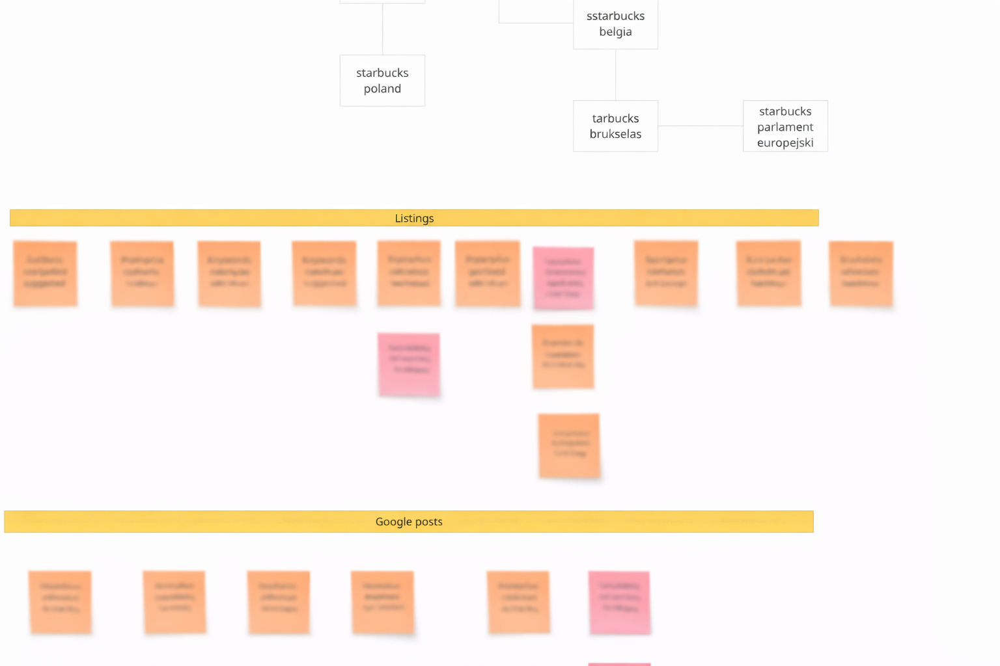

# Demo: Rozpoznawanie archetypu z obrazka — Party Archetype na boardzie Miro

## Input

---

## Co widzę — zanim przeczytam choćby jedną karteczkę

Górna sekcja boardu to **drzewo**. Drzewo to hierarchia, a hierarchia w domenie biznesowej to niemal zawsze struktura organizacyjna.

Korzeń: **Starbucks**. Z niego wychodzą gałęzie: Starbucks Poland, Starbucks Belgia. Z Belgii — Starbucks Brukselas. Z Brukseli — Starbucks Parlament Europejski.

Każda karteczka powtarza to samo słowo „Starbucks" z innym sufiksem — Poland, Belgia, Brukselas, Parlament Europejski. Ktoś tu dekomponuje jedną tożsamość na jej oddziały i lokalizacje.

Linie między karteczkami nie mówią „a potem" (to byłaby sekwencja). Mówią „a w ramach tego" (to jest zawieranie). I na żadnej karteczce nie ma czasownika — same nazwy własne. Nikt nic nie robi, ktoś po prostu **jest**.

## Fit test: Party Archetype

Pytanie: *„Czy mam uczestników, którzy mają tożsamość, pełnią role, mają adresy i tworzą hierarchię?"*

| Sygnał | Obecny? |
|--------|---------|
| Hierarchia organizacyjna (parent → child) | Tak — Starbucks → Poland → ... |
| Nazwy własne bez czasowników | Tak — same byty, żadnych akcji |
| Dekompozycja jednej tożsamości na lokalizacje | Tak — ten sam brand, różne oddziały |
| Relacje zawierania (nie sekwencji) | Tak — linie mówią „w ramach tego" |

**Wynik: pasuje.** To jest Party Archetype — struktura organizacyjna z hierarchią jednostek.

## Co rozpoznajemy z samego obrazka

- **Organization**: Starbucks (korzeń — organizacja macierzysta)
- **OrganizationUnit**: Starbucks Poland, Starbucks Belgia (jednostki krajowe)
- **OrganizationUnit**: Starbucks Brukselas (jednostka miejska, child Belgii)
- **OrganizationUnit**: Starbucks Parlament Europejski (jednostka lokalizacyjna, child Brukseli)
- **Relacja**: hierarchia zawierania — `isPartOf` / `hasUnit`

## Czego NIE widzimy, ale archetyp wie, że trzeba zapytać

Gdybyśmy odpalili skill `party-archetype-mapper`, zadałby pytania, których board nie pokrywa:

- **RegisteredIdentifiers**: Czy każda jednostka ma NIP/KRS/VAT w swoim kraju? Starbucks Poland ma polski KRS, Starbucks Belgia ma belgijski numer rejestrowy?
- **Roles**: Czy te jednostki pełnią różne role w procesach? Np. Starbucks Poland jest „franczyzobiorcą", a Starbucks Belgia „oddziałem własnym"?
- **Addresses**: Czy adres jest per jednostka? Starbucks Parlament Europejski ma konkretny adres fizyczny?
- **Capabilities / OperatingScope**: Czy jednostki mają różny zakres działania? Np. Starbucks Brukselas może sprzedawać alkohol, a Starbucks Parlament Europejski nie?

Te pytania nie wynikają z boardu. Wynikają z archetypu — bo archetyp wie, że hierarchia organizacyjna to dopiero początek. Za każdą jednostką kryją się identyfikatory, role, adresy i zasięgi operacyjne.
